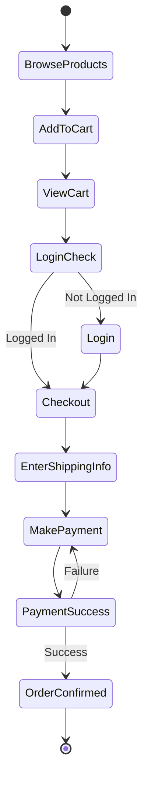
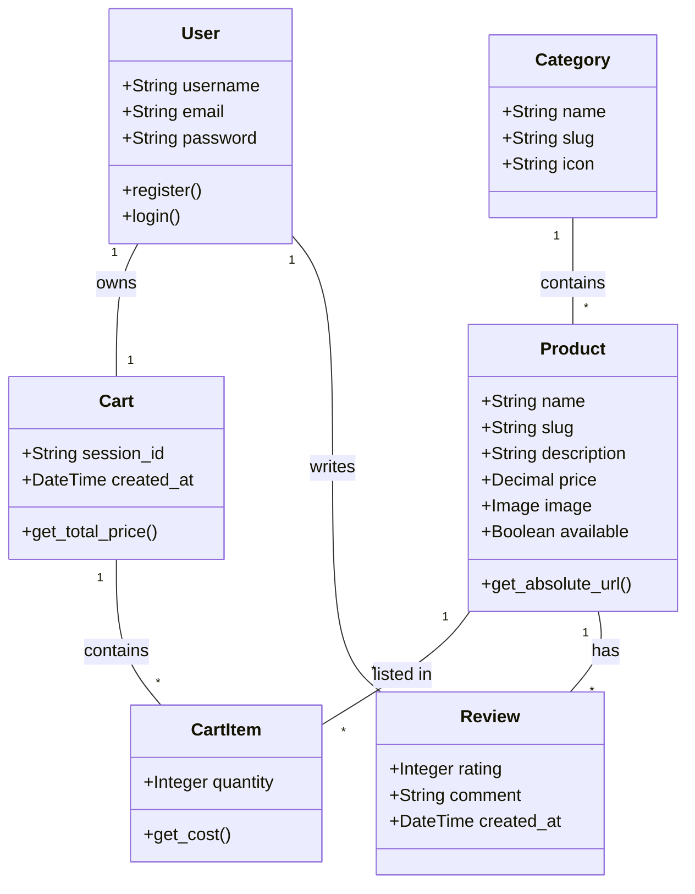
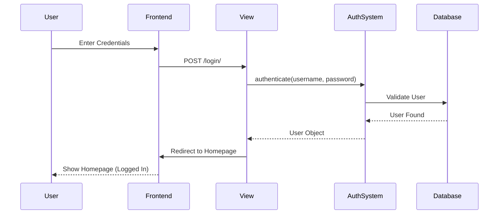
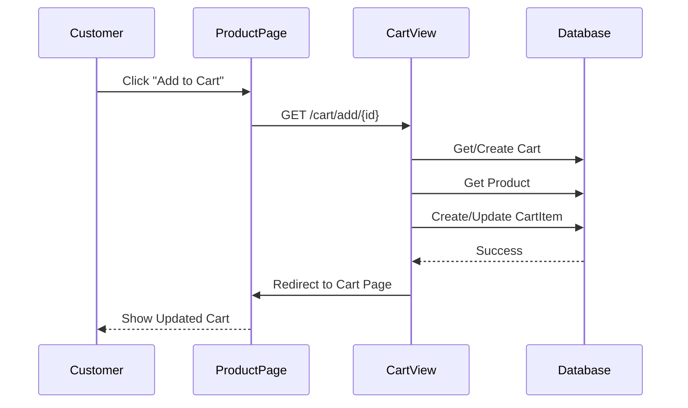
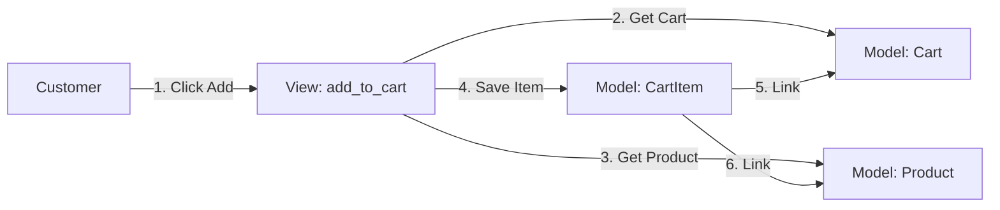
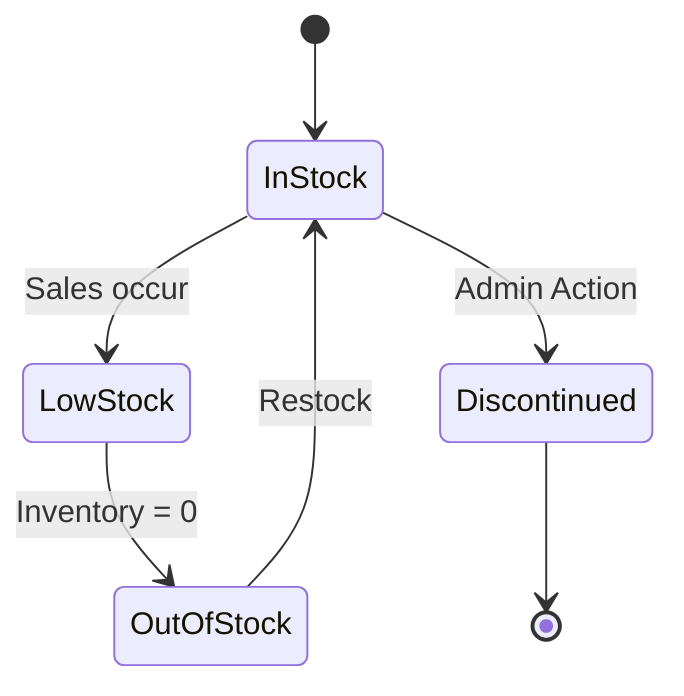
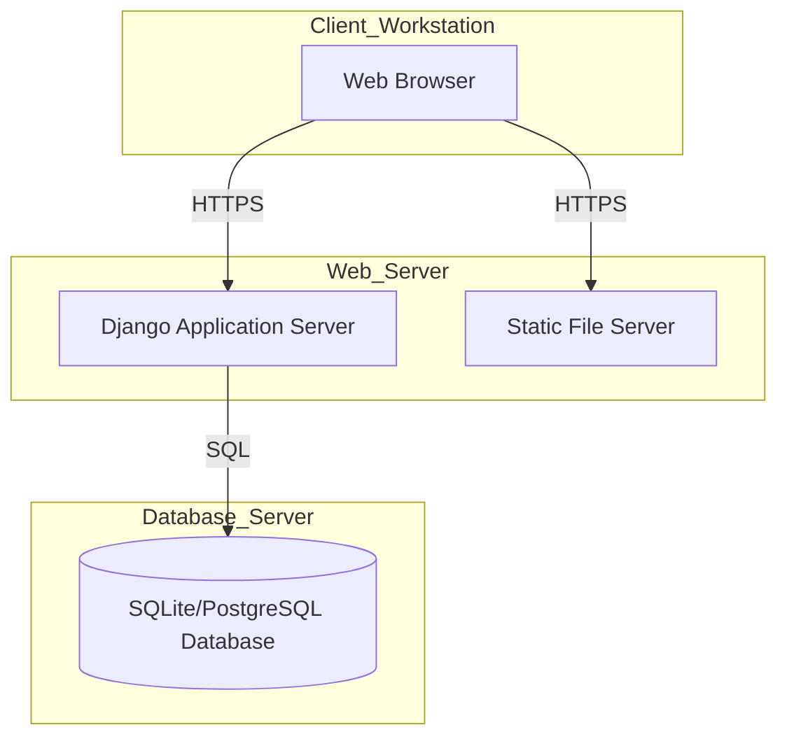

# Software Engineering Project: Hand Made E-Commerce Platform

**Project Name:** Hand Made  
**Domain:** E-Commerce for Handcrafted Goods  
**Technology Stack:** Django (Python), SQLite/PostgreSQL, HTML/CSS/JS

---

## 1. Software Requirements Specification (SRS)
*In line with IEEE Recommended Standards (IEEE Std 830)*

### 1.1 Introduction
**1.1.1 Purpose**  
The purpose of this document is to define the requirements for the "Hand Made" e-commerce system. This system allows users to browse, search, and purchase handcrafted items like keychains, frames, and hampers.

**1.1.2 Scope**  
The system is a web-based application. It handles user authentication, product catalog management, shopping cart functionality, and order processing. It provides an interface for customers to shop and administrators to manage inventory.

### 1.2 Overall Description
**1.2.1 Product Perspective**  
"Hand Made" is a standalone web application. It interacts with a database to store product and user data.

**1.2.2 User Classes and Characteristics**  
*   **Guest User:** Can browse products and view details.
*   **Registered Customer:** Can manage cart, place orders, and write reviews.
*   **Administrator:** Has full access to the Django Admin panel to add/edit/delete products and categories.

### 1.3 Specific Requirements
**1.3.1 Functional Requirements**  
*   **FR1 - Authentication:** Users must be able to register and login.
*   **FR2 - Catalog:** System must display products with images, prices, and descriptions.
*   **FR3 - Search/Filter:** Users can search products and filter by category or price.
*   **FR4 - Cart Management:** Users can add/remove items and update quantities in the cart.
*   **FR5 - Reviews:** Authenticated users can leave ratings and comments on products.

**1.3.2 Non-Functional Requirements**  
*   **NFR1 - Usability:** The UI must be responsive (mobile-friendly).
*   **NFR2 - Performance:** Pages should load within 2 seconds under normal load.
*   **NFR3 - Security:** Passwords must be hashed; CSRF protection must be enabled.

---

## 2. Use Case Diagram
**Actors:**
*   **Customer:** A user who browses and buys products.
*   **Admin:** A user who manages the system.

```mermaid
usecaseDiagram
    actor "Customer" as C
    actor "Admin" as A

    package "Hand Made System" {
        usecase "Register/Login" as UC1
        usecase "Browse Products" as UC2
        usecase "Search & Filter" as UC3
        usecase "Manage Cart" as UC4
        usecase "Place Order" as UC5
        usecase "Write Review" as UC6
        usecase "Manage Inventory" as UC7
    }

    C --> UC1
    C --> UC2
    C --> UC3
    C --> UC4
    C --> UC5
    C --> UC6
    
    A --> UC1
    A --> UC7
```

### Role of Actors
*   **Customer:** Primary actor. Interacts with the frontend to shop.
*   **Admin:** Secondary actor. Interacts with the backend admin panel to maintain the catalog.

---

## 3. Use Case Specifications

### Use Case: Manage Cart
*   **Precondition:** User is viewing a product page.
*   **Postcondition:** The item is added to the user's cart, and the total price is updated.
*   **Function:** Allows the user to select a product and add it to their temporary shopping list for future purchase.

### Use Case: Place Order (Checkout)
*   **Precondition:** User is logged in and has items in the cart.
*   **Postcondition:** An order record is created, the cart is cleared, and the user is redirected to a confirmation page.
*   **Function:** Finalizes the purchase of items currently in the cart.

### Use Case: Manage Inventory
*   **Precondition:** User is logged in as an Administrator.
*   **Postcondition:** Product details are updated in the database.
*   **Function:** Allows the admin to add new products, update prices, or mark items as out of stock.

---

## 4. Activity Diagram
**Scenario:** Customer Checkout Process



---

## 5. Class Diagram
**Classification:**
*   **Strong Classes:** `User`, `Category`, `Product` (Exist independently).
*   **Weak Classes:** `Cart`, `CartItem`, `Review` (Dependent on User or Product).



---

## 6. Sequence Diagrams

### Scenario 1: User Login


### Scenario 2: Add to Cart


---

## 7. Collaboration Diagram (Communication Diagram)
*Note: Representing the "Add to Cart" interaction.*



---

## 8. State Chart Diagram
**Object:** Product Availability State



---

## 9. Component Diagram

```mermaid
componentDiagram
    package "Client" {
        [Browser]
    }

    package "Server (Django)" {
        [Views (Logic)]
        [Templates (UI)]
        [Models (Data)]
        [URL Routing]
    }

    package "Data Storage" {
        [SQLite DB]
        [Media Files]
    }

    [Browser] --> [URL Routing] : HTTP Request
    [URL Routing] --> [Views (Logic)]
    [Views (Logic)] --> [Models (Data)]
    [Views (Logic)] --> [Templates (UI)]
    [Models (Data)] --> [SQLite DB] : ORM
    [Templates (UI)] --> [Media Files] : Static Assets
```

---

## 10. Deployment Diagram


